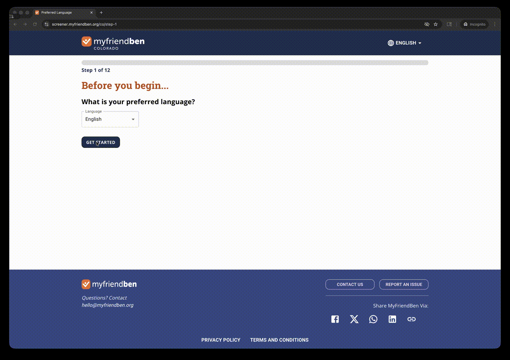

# MyFriendBen Web Application

<div align="center">

<!-- TODO: Add logo/banner image here -->
<!--  -->

**Accessible, multi-step benefits screening form helping families discover government assistance programs**

[](https://reactjs.org/)
[](https://www.typescriptlang.org/)
[](https://mui.com/)
[](LICENSE)

</div>

---

## 🎯 About MyFriendBen

**MyFriendBen** is an intuitive web application that guides families through a simple questionnaire to discover government benefits, tax credits, and nonprofit programs they qualify for. Originally incubated within [Gary Community Ventures](https://garycommunity.org/), a Denver-based nonprofit organization, MyFriendBen has emerged as an independent initiative now expanding to serve communities across multiple states.

### Our Mission

We co-designed MyFriendBen with Colorado families participating in a direct cash assistance program who told us it was difficult and time-consuming to know what benefits they were entitled to. Our goal: **increase benefit participation rates** by making key information—like dollar value and time to apply—more transparent, accessible, and accurate.

---

## 📱 See It In Action



---

### Impact

- **Over 60,000** families served
- **Over $50 Million** in total benefits unlocked
- **5 states** supported (and growing!)
- **115+** benefits screened across federal, state, county, and local programs

### Supported By

Our work is made possible by generous support from:

<p align="center">
[](https://garycommunity.org/)
&nbsp;&nbsp;&nbsp;
[](https://www.gatesfoundation.org/)
&nbsp;&nbsp;&nbsp;
[](https://www.aecf.org/)
</p>

And technical partnership with:

<p align="center">
[](https://codethedream.org/)
&nbsp;&nbsp;&nbsp;
[](https://policyengine.org/us)
</p>

---

## ✨ Key Features

### 🎨 **White Label Multi-Tenant Platform**

Fully customizable branding and theming for different states and partner organizations

### 📝 **Intuitive Multi-Step Form**

- Clean, accessible user interface
- Progressive disclosure to reduce cognitive load
- Mobile-first responsive design
- Clear progress indicators

### 🌍 **Multi-Language Support**

Built-in internationalization (i18n) with dynamic content loading from the backend. Currently supporting 18 languages: English, Spanish, Vietnamese, French, Amharic, Somali, Russian, Nepali, Burmese, Chinese (Simplified), Arabic, Swahili, Polish, Tagalog, Korean, Urdu, Brazilian Portuguese, and Haitian Creole.

### ♿ **Accessibility First**

- WCAG 2.1 AA compliant
- Keyboard navigation
- Screen reader optimized
- High contrast support

### 🔒 **Privacy Focused**

- No personal data stored without consent
- Anonymous screening option
- Secure data transmission

### 🎯 **Smart Results**

- Estimated benefit values
- Application difficulty indicators
- Direct links to apply
- Personalized recommendations

---

## 🏗️ Architecture Overview

This repository contains the **React/TypeScript frontend** that provides the user interface for the benefits screening platform.

```
┌─────────────────┐
│  User Browser   │
└────────┬────────┘
         │
┌────────▼────────┐
│  React App      │ ← This repository
│  - Multi-step   │
│    Form Wizard  │
│  - i18n         │
└────────┬────────┘
         │ REST API
┌────────▼────────┐
│  Django API     │ ← See benefits-api repo
│  - Eligibility  │
│  - Calculations │
└─────────────────┘
```

**Tech Stack:**

- **Framework:** React 18 with TypeScript
- **UI Library:** Material-UI (MUI) v5
- **State Management:** React Context + Hooks
- **Routing:** React Router v6
- **Testing:** Playwright for E2E, Jest for unit tests
- **Build Tool:** Webpack with hot reload
- **Code Quality:** ESLint, Prettier, TypeScript strict mode

**Key Components:**

- Multi-step form wizard with validation
- White label theming system
- Translation management
- Results dashboard with benefit cards
- Responsive layouts for mobile/desktop

---

## 🚀 Quick Start

### Prerequisites

- Node.js 18+ and npm
- Backend API running (see [benefits-api](https://github.com/Gary-Community-Ventures/benefits-api))

### Installation

```bash
# Clone the repository
git clone https://github.com/Gary-Community-Ventures/benefits-calculator.git
cd benefits-calculator

# Install dependencies
npm install

# Set up environment variables
# Create .env file with the following (available in 1Password Engineering vault: "Frontend ENV Vars"):
cp .env.example .env
```

### Environment Variables

Create a `.env` file with:

```bash
# Required
REACT_APP_API_KEY=your_api_key_here
REACT_APP_DOMAIN_URL=http://localhost:8000

# Optional
REACT_APP_GOOGLE_ANALYTICS_ID=your_ga_id
```

### Run Development Server

```bash
npm run dev
```

Visit [http://localhost:3000](http://localhost:3000)

### Run Tests

```bash
# Unit tests
npm test

# E2E tests with Playwright
npm run test:e2e

# Lint
npm run lint

# Type check
npm run type-check
```

---

## 🎨 White Label Configuration

Each state/organization can have custom:

- Logo and branding colors
- Domain name
- Available programs
- Content and translations
- Terms of service

Configuration is managed through the backend API's WhiteLabel model.

---

## 🧪 Testing

**Unit Tests:** Jest + React Testing Library

```bash
npm test
```

**E2E Tests:** Playwright

```bash
npm run test:e2e
npm run test:e2e:ui  # Interactive mode
```

**Coverage:**

```bash
npm run test:coverage
```

---

## 🚢 Production Deployment

**Build for production:**

```bash
npm run build
```

**Deployment Features:**

- Optimized bundle splitting
- Service worker for offline capability
- CDN-ready static assets
- Environment-based configuration
- Source maps for debugging

**Hosting:**

- Currently deployed on [hosting platform]
- Auto-deployment from `main` branch
- Staging environment available

---

## 🤝 Contributing

We welcome contributions! Whether you're fixing bugs, adding features, or improving accessibility.

**Getting Started:**

1. Fork the repository
2. Create a feature branch (`git checkout -b feature/amazing-feature`)
3. Follow our React/TypeScript best practices (see [CLAUDE.md](CLAUDE.md))
4. Write tests for new components
5. Run linter and type checker
6. Submit a pull request

**Development Standards:**

- TypeScript strict mode required
- Component-based architecture
- Hooks over class components
- Accessibility first (a11y testing required)
- Comprehensive Playwright E2E tests
- Responsive design (mobile + desktop)

---

## 📄 License

<!-- TODO: Add license type -->

This project is licensed under the [LICENSE_TYPE] License - see the [LICENSE](LICENSE) file for details.

---

## 🔗 Related Repositories

- **[Backend API](https://github.com/Gary-Community-Ventures/benefits-api)** - Django REST API for eligibility calculations
- **[Documentation](https://github.com/Gary-Community-Ventures/benefits-api/wiki)** - Comprehensive guides and setup instructions

---

## 💬 Contact & Support

- **Website:** [myfriendben.org](https://myfriendben.org)
- **Organization:** [Gary Community Ventures](https://garycommunity.org/)
- **Issues:** [GitHub Issues](https://github.com/Gary-Community-Ventures/benefits-calculator/issues)
<!-- TODO: Add contact email or support links -->

---

<div align="center">

**Built with ❤️ by Gary Community Ventures in partnership with Colorado families**

_Inspired by [AccessNYC](https://github.com/CityOfNewYork/ACCESS-NYC) and powered by [PolicyEngine](https://github.com/PolicyEngine/policyengine-us)_

</div>
